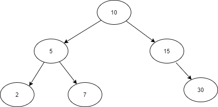

# Binary Trees


Below diagram shows a example of a binary tree. Binary trees are hierarchical data structures. Topmost node in the binary tree is known as root node. In a binary tree should be a maximum of two nodes are in a parent node. The node in the left side of the parent is known as "left node" and right side node is known as right node. Example for a tree data structure is  the file system in a computer. (Note this is tree structure, not a binary tree structure.)





Perfect binary tree is formed when the every level of the binary tree is full of nodes.


### Binary Tree Properties

- The number of nodes in a perfect binary tree doubles when the depth is increased by one. (Assume depth =d, therefore, Number of nodes = 2<sup>d</sup>)
- A perfect binary tree of height h has, 2<sup>(h+1)</sup>-1 nodes. (When the h =0, this formula becomes 1, which is equal to (number of nodes in the height level minus 1 (because there is only one node at root level.)))
- In a perfect binary tree, number of child nodes at height h is 2<sup>h</sup>
- Number of internal nodes in a perfect binary tree of height h is equal to 2<sup>h</sup>-1
- Minimum number of nodes in a height of h binary tree is h+1
- Maximum number of nodes in a height of h binary tree is  2<sup>(h+1)</sup>-1.

### Binary Tree Implementation (Python)

As the binary tree is consisting of nodes, each node have basically 3 values to store as reference to left node and reference to right node and the value of the node.

```python
class Node:

    def __init__(self, left, right, value):
        self.left = left
        self.right = right
        self.value = value
```

Then we can declare the class as follows,

```python
class BinaryTree:

    def __init__(self, root=None):
        self.size = 0
        self.root = root

```

Inserting a value to the tree.(This tree doesn't inserts duplicated values)

```python
    def insert(self, node):
        if self.root is None:
            self.root = node
        else:
            self._insert(self.root, node)

    def _insert(self, curr_node, node):
        if curr_node.left is None or curr_node.right is None:
            if curr_node.value >= node.value:
                curr_node.left = node
                self.size += 1
            else:
                self.size += 1
                curr_node.right = node
        else:
            if curr_node.value > node.value:
                self._insert(curr_node.left, node)
            elif curr_node.value < node.value:
                self._insert(curr_node.right, node)
            else:
                print("Value already in the tree")

```

### Tree Traversal

Binary tree have three types of traversal mechanisms,

- In-order traversal (Left >Root>Right)
- Post-order traversal (Left>Right>Root)
- Pre-order traversal(Root>Left>Right)

In-Order traversal,

```python
    def print_tree_in_order(self):
        if self.get_length() <= 0:
            return "Empty Tree"
        else:
            self._print_tree_in_order(self.root)

    def _print_tree_in_order(self, curr_node):
        if curr_node is not None:
            self._print_tree_in_order(curr_node.left)
            print(curr_node.value)
            self._print_tree_in_order(curr_node.right)
```

Post-order

```python
    def print_tree_post_order(self):
        if self.get_length() <= 0:
            return "Empty Tress"
        else:
            self._print_tree_post_order(self.root)

    def _print_tree_post_order(self, curr_node):
        if curr_node is not None:
            self._print_tree_post_order(curr_node.left)
            self._print_tree_post_order(curr_node.right)
            print(curr_node.value)
```

Pre-order

```python
    def print_tree_pre_order(self):
        if self.get_length() <= 0:
            return "Empty Tree"
        else:
            self._print_tree_pre_order(self.root)

    def _print_tree_pre_order(self, curr_node):
        if curr_node is not None:
            print(curr_node.value)
            self._print_tree_pre_order(curr_node.left)
            self._print_tree_pre_order(curr_node.right)
```

Complete implementation of this can be found [here](https://github.com/erandakarachchi/pydsa/blob/master/binary_tree.py).